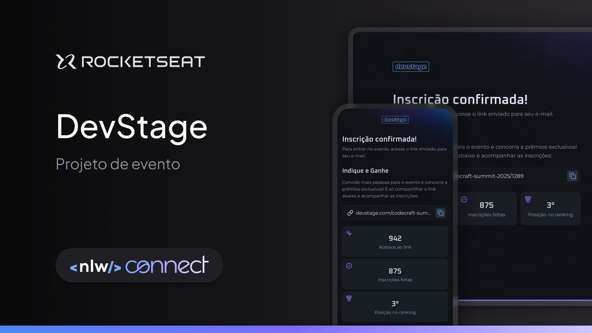

---
<h1 align="center">📥  Devstage</h1>



<p align="center">
<b>Plataforma para conectar desenvolvedores a comunidades e oportunidades em tecnologia. 🚀</b>
</p>
---

## 📋 Índice

- [📖 Sobre](#-sobre)
- [🛠 Tecnologias Utilizadas](#-tecnologias-utilizadas)
- [📦 Como Baixar e Rodar o Projeto](#-como-baixar-e-rodar-o-projeto)
- [🔗 Conexão com o Backend](#-conexão-com-o-backend)
- [👩‍💻 Desenvolvedora](#-desenvolvedora)

---

## 📖 Sobre

**Devstage** é uma plataforma para conectar desenvolvedores a comunidades e oportunidades em tecnologia.

> Com uma interface amigável e responsiva!

---

## 🛠 Tecnologias Utilizadas

O projeto foi desenvolvido com as seguintes ferramentas e bibliotecas modernas:

- **Frameworks e Bibliotecas**
  - [NextJS](https://nextjs.org/)
  - [TypeScript](https://www.typescriptlang.org/)
  - [TailwindCSS](https://tailwindcss.com/)
  - [Tailwind Merge](https://www.npmjs.com/package/tailwind-merge)
  - [Lucide Icons](https://lucide.dev/)
  - [React Hook Form](https://www.react-hook-form.com/)
  - [Zod](https://zod.dev/)
  - [Orval](https://orval.dev/)

---

## 📦 Como Baixar e Rodar o Projeto

Siga os passos abaixo para rodar o **Devstage** localmente:

```bash
# Clone este repositório
$ git clone https://github.com/vanessabrazuna/devstage.git

# Acesse a pasta do projeto
$ cd devstage

# Instale as dependências
$ npm install

# Inicie o servidor de desenvolvimento
$ npm run dev
```

Pronto! Agora é só acessar [http://localhost:3333](http://localhost:3333) no navegador. 📥✨

---

## 🔗 Conexão com o Backend

Para conectar o **Devstage** ao backend, siga os passos abaixo:

1. Clone o repositório do backend disponível no link:  
   [https://github.com/rocketseat-education/nlw-connect-node.git](https://github.com/rocketseat-education/nlw-connect-node.git)

```bash
# Clone o backend
$ git clone https://github.com/rocketseat-education/nlw-connect-node.git

# Acesse a pasta do backend
$ cd nlw-connect-node

# Instale as dependências
$ npm install

# Rodar o docker
$ docker compose up -d

# Rodar as migrations
$ npm run db:migrate

# Inicie o servidor backend
$ npm run dev
```

Por padrão, o servidor backend estará rodando em `http://localhost:3333`. Certifique-se de que o frontend está configurado para acessar esse endpoint.

---

## 📊 Documentação da API

A documentação da API está disponível em:

[http://localhost:3333/docs](http://localhost:3333/docs)

Acesse para visualizar os endpoints, requisições e respostas suportadas pelo backend. 📝

---

## 👩‍💻 Desenvolvedora

Feito com 💜 por **[Vanessa Brazuna](https://github.com/vanessabrazuna)**

Conecte-se comigo no [LinkedIn](https://www.linkedin.com/in/vanessabrazuna) para acompanhar mais projetos incríveis! 🚀

---
